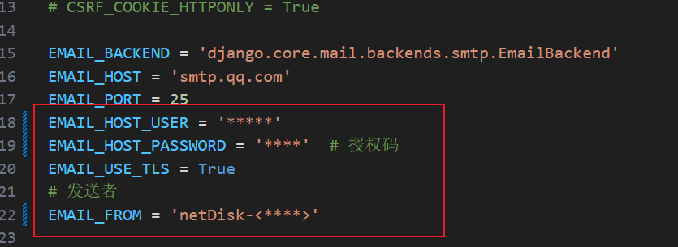
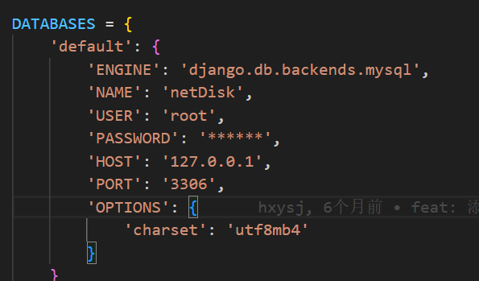
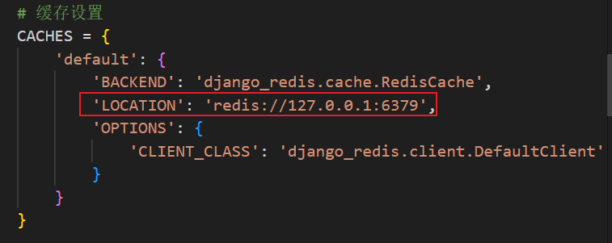
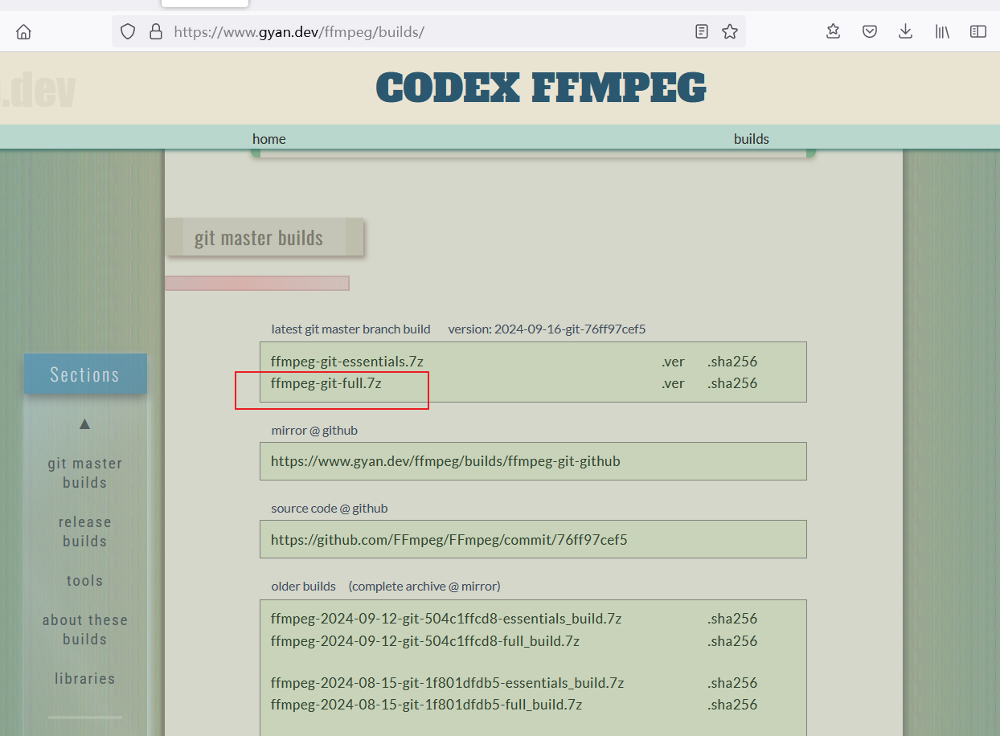
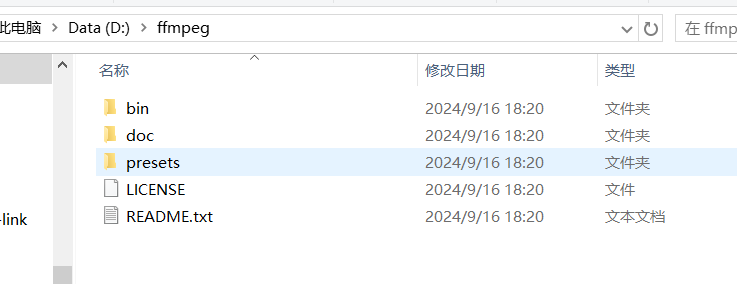
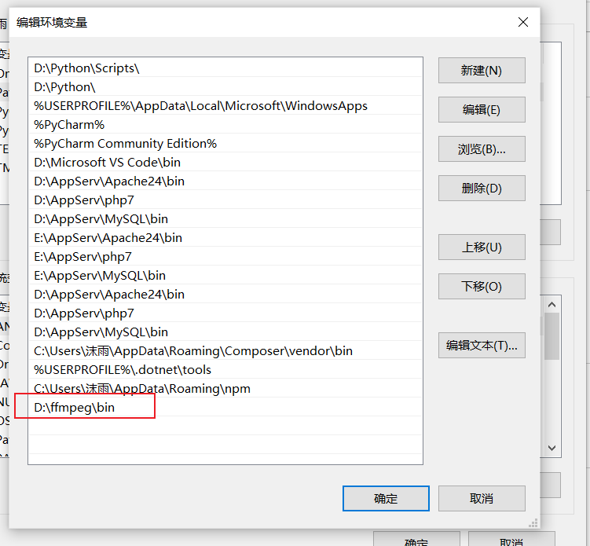
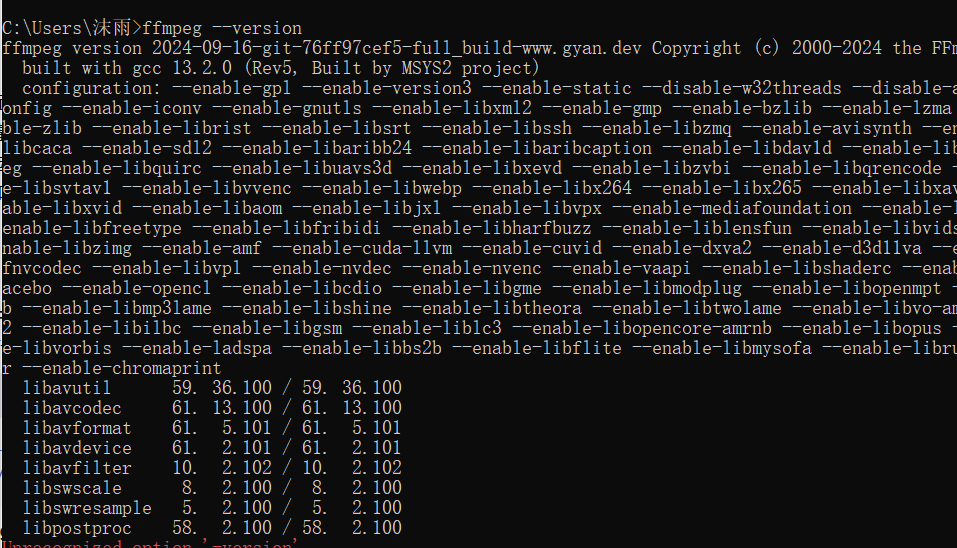
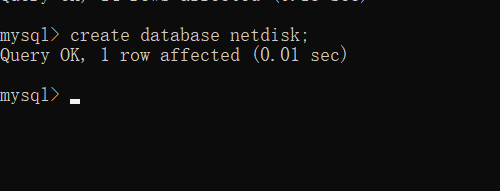
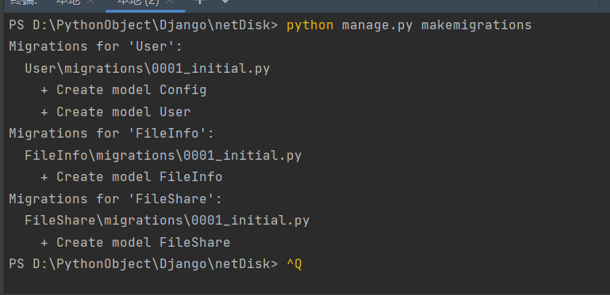
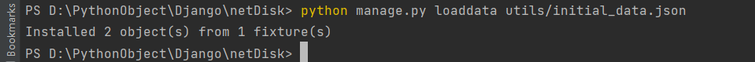

## 个人网盘系统项目

### 项目介绍

本项目为 net-disk 的后端项目，使用 Django 框架实现，为 net-disk 项目提供 websocket 接口地址以及文件上传管理的接口地址

### netDisk 前端项目地址

```
net-disk: https://github.com/hxysj/net-disk
```

### 需要进行配置的内容

#### 配置邮箱授权信息

用来发送用户注册时的邮箱验证码



#### 配置数据库地址与密码



#### 配置 redis 的地址



### 安装相关依赖

```
python install -r requirements.txt
```

#### 安装FFmpeg

用来进行视频切割

下载[FFmpeg](https://www.gyan.dev/ffmpeg/builds)



解压FFmpeg



将bin添加到环境变量



检查是否安装成功

```
ffmpeg --version
```



#### 安装celery

#### 安装 aspose - 有水印

```
pip install aspose
```

用来将doc文件转换成docx文件

#### 安装pycryptodome

```
pip install pycryptodome
```

用于分块文件的解密

#### 安装channels，daphne

```
pip install channels,channels_redis
pip install daphne
```

用于建立websocket连接

### 项目运行

#### 下载项目

```
git clone https://github.com/hxysj/net-disk-server.git

cd net-disk-server

```

#### 迁移数据库

在 mysql 中创建对应的数据库



```
python manage.py makemigrations

python manage.py migrate
```




#### 初始化数据

```
python manage.py loaddata utils/initial_data.json
```



管理员： admin123

密码：111111

#### 启动 django 服务

```
python manage.py runserver
```

#### 启动 websocket 服务

终端中运行

```
daphne -b 127.0.0.1 -p 8001 netDisk.asgi:application
```

#### 通过脚本创建测试用户

在项目根目录下net-disk-server

```
python scripts/create_test_user.py
或者
PYTHONPATH=$(pwd) python scripts/create_test_user.py
```

